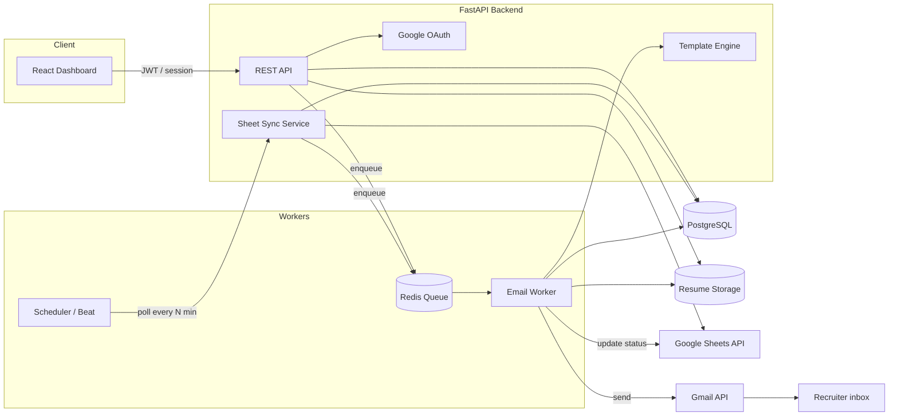
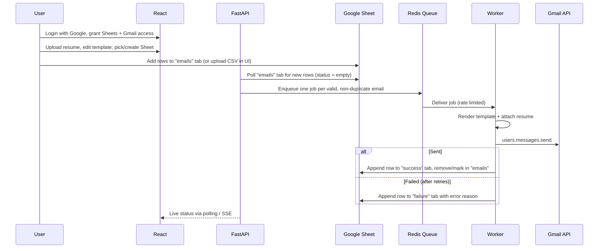
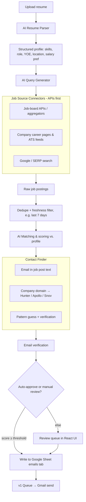

# JobPilot – Automated Job Application Emailer

> Stop copy-pasting the same cold email and resume attachment. Add recruiter / career emails once, and let the system send personalised applications from your own Gmail, track the results, and (in v2) find new recruiter emails for you.

---

## 1. Problem Statement

As a developer looking for a job change, I currently:

1. Manually browse **LinkedIn, Naukri, Indeed, Wellfound** and **company career pages**.
2. Find the recruiter / HR / careers email for each opening.
3. Copy-paste the previous email text, tweak it, and attach the resume.
4. Repeat this for every company, every day.

This is slow, repetitive, and error-prone (wrong name, forgotten attachment, duplicate emails to the same company, no tracking).

**Goal:** Automate steps 2–4 in **v1**, and step 1–2 in **v2**.

---

## 2. Tech Stack

| Layer | Choice | Notes |
|---|---|---|
| Frontend | **React** (Vite + TypeScript) | Dashboard, upload, template editor, logs |
| Backend | **Python – FastAPI** | REST API, OAuth, business logic |
| Queue / Workers | **Celery + Redis** (or ARQ / RQ for a lighter setup) | Rate-limited, retryable email sending |
| Database | **PostgreSQL** (SQLite OK for local dev) | Users, jobs, send logs, dedupe, tokens |
| File storage | Local disk (dev) / S3-compatible (prod) | Resume PDFs |
| Email sending | **Gmail API** (OAuth 2.0, `gmail.send` scope) | Sends *from the user's own Gmail* |
| Spreadsheet | **Google Sheets API** | `emails`, `success`, `failure` tabs |
| AI (v2) | Claude / OpenAI / Gemini API | Resume parsing, query generation, email personalisation |

---

## 3. Sample Email Template (default)

**Subject:** `{{years_exp}} YOE | Immediate Joiner ({{notice_period}}) | {{role}}`

```
Dear Hiring Manager,   (or "Dear {{recruiter_name}},")

I hope you are doing well.

I am writing to express my interest in any {{role}} opportunities at {{company}}.
I have {{years_exp}} years of experience in Full Stack Development, specializing in
React.js, Node.js, Next.js, Angular, MongoDB, and AI integrations.

I have worked on scalable web applications and integrated AI technologies such as
OpenAI, Gemini, and Claude into production systems.

Please find my resume attached for your consideration. I would appreciate the
opportunity to discuss how my skills and experience can contribute to your team.

Thank you for your time and consideration. I look forward to hearing from you.

Best regards,
{{full_name}}
{{phone}}
```

**Supported placeholders:** `{{full_name}}`, `{{phone}}`, `{{role}}`, `{{company}}`, `{{recruiter_name}}`, `{{years_exp}}`, `{{notice_period}}`, `{{skills}}`.
If a placeholder is missing for a row (e.g. no recruiter name), the template falls back to a default ("Hiring Manager" / empty company).

---

## 4. High-Level Architecture



### 4.1 Email send flow (v1)



### 4.2 Component responsibilities

| Component | Responsibility |
|---|---|
| **React Dashboard** | Google login, resume upload, template editor with preview, email list upload (CSV / paste), manual "Send now", daily limit settings, logs and stats |
| **Auth service** | Google OAuth 2.0 (Authorization Code flow, offline access). Stores refresh token **encrypted** |
| **Sheet Sync service** | Reads the `emails` tab, validates rows, writes results to `success` / `failure` |
| **Template engine** | Jinja2 rendering with placeholders and safe fallbacks |
| **Email worker** | Builds MIME message (HTML + plain text + PDF attachment), sends via Gmail API, handles retries and backoff |
| **Scheduler** | Periodic sheet polling, daily send windows, follow-up reminders (v1.5) |
| **DB** | Source of truth for send state; Sheet is the *user-facing view* |

---

## 5. Data Model

### 5.1 Google Sheet layout

Three tabs, created automatically by the app on first connect.

**`emails`** (user input)

| email | company | role | recruiter_name | notes |
|---|---|---|---|---|
| careers@acme.com | Acme Inc | Full Stack Developer | | found on website |

Only `email` is mandatory. Everything else is optional.

**`success`** (written by the app)

| email | company | role | sent_at | gmail_message_id | template_version |
|---|---|---|---|---|---|

**`failure`** (written by the app)

| email | company | role | failed_at | reason | attempts |
|---|---|---|---|---|---|

### 5.2 Database tables (PostgreSQL)

```
users            (id, google_sub, email, name, phone, created_at)
oauth_tokens     (user_id, access_token_enc, refresh_token_enc, scopes, expires_at)
resumes          (id, user_id, file_path, original_name, is_default, uploaded_at)
templates        (id, user_id, name, subject, body_html, body_text, version, is_default)
sheets           (id, user_id, spreadsheet_id, last_synced_at)
targets          (id, user_id, email, company, role, recruiter_name, source, status,
                  UNIQUE(user_id, email))         -- status: pending|queued|sent|failed|skipped|bounced
send_logs        (id, target_id, template_id, resume_id, status, gmail_message_id,
                  error, attempts, sent_at)
settings         (user_id, daily_limit, send_window_start, send_window_end,
                  min_delay_sec, max_delay_sec, timezone)
```

---

## 6. v1 – Manual Input, Automated Sending

> **Scope:** The user finds emails themselves. The system removes everything *after* that: templating, attachment, sending, tracking.

### 6.1 Functional requirements

**Auth & setup**
- FR-1: Sign in with Google. Request scopes: `gmail.send`, `spreadsheets` (or `drive.file` if the app creates the sheet itself – preferred, narrower scope), `userinfo.email`.
- FR-2: App can **create** a new Google Sheet with the 3 tabs (`emails`, `success`, `failure`) **or** connect an existing one.
- FR-3: User profile: name, phone, years of experience, notice period, target role.

**Resume & template**
- FR-4: Upload resume (PDF, max 5 MB). Support multiple resumes with one default.
- FR-5: Template editor with live preview and placeholder helper. Template is versioned.
- FR-6: Send a **test email to self** before going live.

**Input**
- FR-7: Add emails via (a) Google Sheet `emails` tab, (b) CSV upload in the UI, (c) paste a list in the UI.
- FR-8: Validate each email (syntax, MX lookup optional, disposable-domain check).
- FR-9: **De-duplicate** – never email the same address twice (configurable cool-down, e.g. 30 days).

**Sending (queue)**
- FR-10: Each valid target becomes a queue job. Worker sends via Gmail API with resume attached.
- FR-11: **Rate limiting & human-like pacing**: daily limit (default 30–50), random delay 30–120 s between sends, send only in a configurable time window (e.g. 9:00–18:00 IST, Mon–Fri).
- FR-12: Retry with exponential backoff (max 3 attempts) for transient errors (429, 5xx). No retry for permanent errors (invalid address).
- FR-13: Move/append result to `success` or `failure` tab with reason. Remove or mark processed rows in `emails` so nothing is sent twice.
- FR-14: Idempotency key per target so a worker crash never causes a duplicate send.

**Dashboard**
- FR-15: Stats: pending / sent / failed today, this week, all time.
- FR-16: Log table with filters, error reasons, "retry failed" button, "pause all" switch.

### 6.2 Non-functional requirements

| Area | Requirement |
|---|---|
| Security | Encrypt OAuth tokens at rest (Fernet / KMS). HTTPS only. Never log token or resume content. |
| Privacy | Resume and contacts are private per user. Provide "delete my data" and "revoke Google access". |
| Reliability | Queue is durable; jobs survive restarts. Idempotent sends. |
| Deliverability | Plain-text + HTML parts, proper `Subject`, one recipient per message (never CC/BCC a list). |
| Observability | Structured logs, Sentry for errors, simple metrics (sent/failed per day). |
| Performance | Sheet polling every 1–5 min; sheet writes batched to respect API quota. |

### 6.3 Gmail / Sheets limits to design around

- Personal Gmail: roughly **500 recipients/day**; Google Workspace: higher. Cold sending at that volume will get the account flagged, so keep the **default at 30–50/day** and ramp slowly.
- Sheets API has per-minute quotas → batch reads/writes (`batchUpdate`, `values.append` with many rows).
- `gmail.send` and Sheets scopes are *sensitive/restricted*. For **personal use**, keep the OAuth app in "Testing" mode with yourself as a test user. For public release, Google verification is required.

### 6.4 v1 API sketch (FastAPI)

```
POST   /auth/google/login              → redirect to Google
GET    /auth/google/callback           → exchange code, create session
GET    /me                             → profile + connection status

POST   /resumes                        → upload PDF
GET    /resumes                        → list
PUT    /resumes/{id}/default

GET    /templates        POST /templates        PUT /templates/{id}
POST   /templates/{id}/preview         → render with sample data
POST   /templates/{id}/test-send       → send to self

POST   /sheets/create                  → create 3-tab sheet
POST   /sheets/connect                 → attach existing sheet id
POST   /sheets/sync                    → force sync now

POST   /targets/upload                 → CSV / pasted list
GET    /targets?status=&q=
POST   /targets/{id}/retry

POST   /campaign/start | /pause | /resume
GET    /stats
GET    /logs
```

### 6.5 v1 Milestones

| # | Milestone | Deliverable |
|---|---|---|
| M1 | Project scaffold | FastAPI + React + Docker Compose (Postgres, Redis) |
| M2 | Google OAuth | Login, token storage, scopes |
| M3 | Sheet integration | Create sheet, read `emails`, write `success`/`failure` |
| M4 | Resume + template | Upload, versioning, preview, test send |
| M5 | Queue + worker | Celery worker, Gmail send, retries, rate limiting |
| M6 | Dashboard | Stats, logs, pause/resume, CSV upload |
| M7 | Hardening | Dedupe, validation, error handling, deploy |

### 6.6 v1 Acceptance criteria

- [ ] I log in with Gmail and the app creates my 3-tab sheet.
- [ ] I add 10 emails to `emails`; within a few minutes they are sent from **my** Gmail with my resume attached.
- [ ] Sent rows appear in `success` with a timestamp; bad addresses appear in `failure` with a reason.
- [ ] Adding the same email again does **not** send a second time.
- [ ] Killing the worker mid-run and restarting causes **no duplicate** sends.
- [ ] Daily limit and send window are respected.

---

## 7. v2 – AI-Powered Recruiter Discovery

> **Scope:** The system finds fresh job openings and the matching recruiter / careers email automatically, pushes them into the sheet, and v1's pipeline sends them.

### 7.1 Overview



### 7.2 Functional requirements

**Resume understanding**
- V2-1: Parse resume (PDF/DOCX) with an LLM into structured JSON: name, contact, skills, YOE, current/target roles, location, education, key projects.
- V2-2: User can edit the parsed profile and set preferences: target titles, locations / remote, min experience, excluded companies, keywords to exclude.

**Job discovery ("Recruiter Scrapper")**
- V2-3: Pluggable **connector** interface (`search(profile, filters) → list[JobPosting]`) so sources can be added or removed without touching the core.
- V2-4: Scheduled runs (e.g. every 6–12 h) pulling only **recent** postings (last 24–72 h).
- V2-5: Normalise postings into one schema: `title, company, company_domain, location, posted_at, url, description, source, contact_email?`.
- V2-6: Dedupe across sources (company + title + location hash).

**Matching & ranking**
- V2-7: LLM scores each posting 0–100 against the profile with a one-line reason. Below threshold → discarded.
- V2-8: (Optional) generate a **personalised first line** per job (e.g. "I saw your opening for a Full Stack Developer working with React and Node…") injected into the template. Keep the rest of the template fixed to avoid hallucinated claims.

**Contact finding**
- V2-9: Extract an email from the posting if present (many Indian startup posts say "send resume to …").
- V2-10: Otherwise resolve the company domain and query an email-finder API for HR / recruiter / talent-acquisition contacts.
- V2-11: Verify addresses (syntax + MX + SMTP/verification API) and store a confidence score. Skip anything below the threshold to protect sender reputation.

**Human in the loop**
- V2-12: Review queue in the UI: see job, match score, contact, generated email preview → approve / edit / reject.
- V2-13: Auto-approve mode for high-confidence matches only (user-configurable).

**Pipeline integration**
- V2-14: Approved items are written to the Google Sheet `emails` tab (with `source`, `job_url`, `match_score`) and then flow through the **same v1 queue**.
- V2-15: Track replies (Gmail API `threads.list` / label watch) and mark target as `replied` in the dashboard.
- V2-16: Optional follow-up email after N days with no reply (max 1).

### 7.3 Third-party research (to be validated before building)

> ⚠️ Pricing, free tiers and terms change often. **Verify each provider's current pricing, API limits and Terms of Service before committing.** This list is a starting point for the research spike.

**A. Job sources (prefer official APIs / aggregators over scraping)**

| Source | Approach | Notes |
|---|---|---|
| Aggregator APIs (e.g. **Adzuna**, **JSearch on RapidAPI**, **Jooble**, **The Muse**, **RemoteOK / Remotive / WeWorkRemotely feeds**) | REST API / RSS | Legal, stable; coverage of India varies |
| **Greenhouse / Lever / Ashby / Workable** public job-board endpoints | Public JSON per company | Great for startups; need company slug list |
| **Wellfound** | No open public API | Manual or via a compliant data vendor |
| **LinkedIn** | No public job-search API | Scraping violates ToS and is actively blocked / litigated. Use only the user's own saved alerts (email digests) as input |
| **Naukri / Indeed** | No public API for general use | Same ToS caution; use job-alert emails parsed from the user's Gmail (with consent) |
| **Google search / SERP APIs** (SerpAPI, Serper.dev, Brave Search API) | `site:` queries such as `"hiring" "Full Stack" "send resume" email` | Good for finding posts that contain contact emails |
| **Apify actors / ScrapingBee / Bright Data** | Managed scraping | Faster to ship, but the legal/ToS risk stays with you |

**B. Email / contact finders**

| Provider | Typical use |
|---|---|
| **Hunter.io** | Domain search → emails + patterns + verifier |
| **Apollo.io** | People search by title (e.g. "Talent Acquisition") |
| **Snov.io** | Domain search + drip + verifier |
| **RocketReach**, **Skrapp**, **Lusha**, **Dropcontact** | Alternatives; compare India coverage |
| **ZeroBounce / NeverBounce / Kickbox / Abstract** | Email **verification** only |
| Note on **Proxycurl** | Was a popular LinkedIn-data API; reported to have shut down after a LinkedIn lawsuit. Treat LinkedIn-data vendors as high-risk |

**C. AI layer**
- Resume parsing, matching and personalisation → **Claude / OpenAI / Gemini** via a thin `LLMProvider` interface so the model can be swapped.
- Use **structured output (JSON schema / tool calling)** for parsing and scoring, and cache results per resume hash.

**Research spike deliverable:** a comparison table (coverage for India, cost per 1k lookups, accuracy on 50 sample companies, ToS risk) and a recommended stack. Suggested timebox: 3–5 days.

### 7.4 Recommended v2 approach (pragmatic order)

1. **Start with legal, low-friction sources:** ATS public feeds (Greenhouse/Lever/Ashby), aggregator APIs, remote job feeds, and parsing the user's own job-alert emails from LinkedIn/Naukri/Indeed.
2. **Add SERP-based discovery** for "send your resume to …" posts.
3. **Add a contact finder** (Hunter or Apollo) + a verifier.
4. Only then consider managed scraping, with full awareness of ToS risk.

### 7.5 v2 additional components

```
app/
 ├─ connectors/            # one file per job source, all implement BaseConnector
 │   ├─ base.py
 │   ├─ greenhouse.py  lever.py  adzuna.py  serp.py  gmail_alerts.py
 ├─ contacts/              # email finder + verifier adapters
 │   ├─ hunter.py  apollo.py  verifier.py
 ├─ ai/
 │   ├─ resume_parser.py   job_matcher.py   personaliser.py   llm_provider.py
 ├─ pipelines/
 │   └─ discovery.py       # orchestrates: search → dedupe → match → contact → review/sheet
 └─ workers/
     ├─ discovery_task.py  └─ email_task.py
```

New DB tables: `profiles`, `job_postings`, `contacts`, `discovery_runs`, `match_scores`, `reply_events`.

### 7.6 v2 Milestones

| # | Milestone | Deliverable |
|---|---|---|
| V2-M0 | Research spike | Provider comparison + decision doc |
| V2-M1 | Resume parser | LLM parsing + editable profile UI |
| V2-M2 | Connectors (2–3) | ATS feeds + one aggregator + SERP |
| V2-M3 | Matching | Scoring, threshold, dedupe |
| V2-M4 | Contact finder | Hunter/Apollo + verification + confidence |
| V2-M5 | Review queue | UI approve/edit/reject + sheet write |
| V2-M6 | Reply tracking | Gmail reply detection, follow-ups |
| V2-M7 | Hardening | Cost caps, caching, monitoring |

### 7.7 v2 Acceptance criteria

- [ ] Upload a resume → profile is parsed and shown for editing.
- [ ] A scheduled run finds ≥ N fresh, relevant postings with **no manual searching**.
- [ ] Each approved posting has a verified recruiter/careers email and appears in the `emails` tab.
- [ ] The v1 pipeline sends them with the resume attached, respecting limits.
- [ ] Replies are detected and shown in the dashboard.
- [ ] Monthly third-party / LLM spend stays under a configurable cap.

---

## 8. Improvements Added Beyond the Original Idea

| Improvement | Why it matters |
|---|---|
| **Database as source of truth, Sheet as a view** | Sheets is slow, rate-limited and easy to edit by accident; DB guarantees no double sends |
| **Dedupe + cool-down** | Avoids spamming the same company; protects reputation |
| **Daily cap, random delays, send windows** | Mimics human behaviour and avoids Gmail spam flags |
| **Test-send & preview** | Catch template bugs before 50 recruiters see them |
| **Email verification before sending** | Bounces hurt your Gmail sender reputation |
| **Human review queue in v2** | LLMs and finders make mistakes; you stay in control |
| **Reply & bounce tracking** | Know who responded; stop emailing bounced/unsubscribed contacts |
| **Opt-out / suppression list** | Respect "don't contact me" replies |
| **Provider-agnostic connectors and LLM interface** | Third-party APIs change or disappear; swap without a rewrite |
| **Cost guardrails** | Finder and LLM calls can get expensive silently |
| **Personalised first line (optional)** | Higher reply rates than a pure template, with low hallucination risk |
| **Multiple resumes / templates per role** | Different roles (Full Stack vs. AI Engineer) need different pitches |

---

## 9. Compliance & Risk Notes

- **ToS:** Scraping LinkedIn, Naukri, Indeed or Wellfound directly can get your accounts banned and may expose you legally. Prefer official APIs, public ATS feeds and your own alert emails.
- **Anti-spam:** Even job-application cold emails should be relevant, individually addressed, honest, and easy to opt out of. Avoid mass-blast behaviour.
- **Privacy:** Recruiter emails are personal data. India's **DPDP Act 2023** (and GDPR/CAN-SPAM when contacting those regions) applies to how you collect, store and use them. Store the minimum, allow deletion, don't resell.
- **Account safety:** Heavy automated sending can lead Google to suspend your Gmail. Start low, ramp gradually, use a dedicated job-search address if possible.
- **OAuth secrets:** Never commit `client_secret`, tokens or `.env` to Git.

---

## 10. Suggested Project Structure

```
jobpilot/
├─ frontend/                 # React (Vite + TS)
│   └─ src/
│       ├─ pages/            # Login, Dashboard, Targets, Template, Resume, Settings, Review (v2)
│       ├─ components/
│       └─ api/              # axios/react-query clients
├─ backend/                  # FastAPI
│   └─ app/
│       ├─ main.py
│       ├─ api/              # routers: auth, resumes, templates, sheets, targets, campaign, stats
│       ├─ core/             # config, security, encryption, logging
│       ├─ models/           # SQLAlchemy models
│       ├─ schemas/          # Pydantic schemas
│       ├─ services/         # gmail.py, sheets.py, template.py, validators.py
│       ├─ workers/          # celery_app.py, email_task.py, sync_task.py
│       ├─ connectors/       # (v2)
│       ├─ contacts/         # (v2)
│       └─ ai/               # (v2)
├─ docker-compose.yml        # api, worker, beat, redis, postgres, frontend
├─ .env.example
└─ README.md
```

---

## 11. Getting Started (planned)

```bash
# 1. Clone and configure
cp .env.example .env
# Fill in: GOOGLE_CLIENT_ID, GOOGLE_CLIENT_SECRET, SECRET_KEY, ENCRYPTION_KEY,
#          DATABASE_URL, REDIS_URL, (v2) LLM_API_KEY, HUNTER_API_KEY ...

# 2. Google Cloud setup
#    - Create project → enable Gmail API + Google Sheets API (+ Drive API)
#    - OAuth consent screen (Testing mode, add yourself as test user)
#    - OAuth client (Web) with redirect URI: http://localhost:8000/auth/google/callback

# 3. Run everything
docker compose up --build

# Frontend: http://localhost:5173
# API docs: http://localhost:8000/docs
```

---

## 12. Roadmap Summary

| Version | Theme | Outcome |
|---|---|---|
| **v1** | Manual input → automatic sending | Add emails to a sheet; app emails them with your resume and tracks results |
| **v1.5** | Quality of life | Follow-ups, multiple templates/resumes, reply tracking |
| **v2** | AI discovery | Upload resume → AI finds fresh openings and recruiter emails → review → auto-send |

---

## 13. Open Questions

1. Single user (personal tool) or multi-user SaaS later? This changes OAuth verification, billing and security effort.
2. Daily send target (10, 30, 50)? Determines how careful the warm-up needs to be.
3. Which regions / role types for v2 (India-only, remote global)? Drives the choice of job sources.
4. Budget ceiling for third-party APIs per month?
5. Should v2 auto-send, or always require approval?

---

*Author: Shubham Sharma · Status: Planning · Last updated: October 2026*
